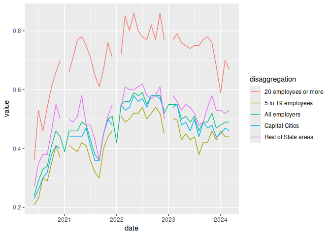
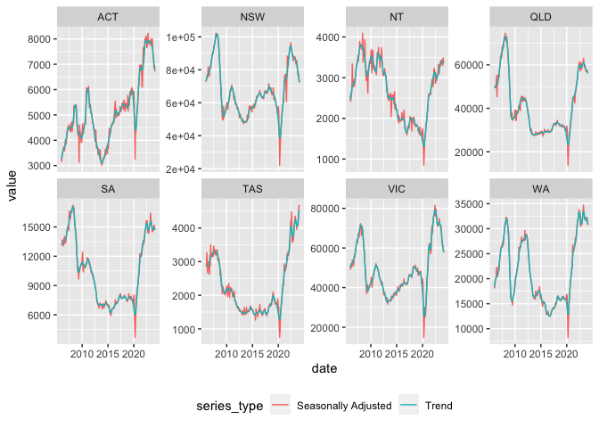

<!-- README.md is generated from README.Rmd. Please edit that file -->

# readjsa

<!-- badges: start -->

[](https://github.com/MattCowgill/readjsa/actions/workflows/R-CMD-check.yaml)
<!-- badges: end -->

{readjsa} streamlines the process of getting data from [Jobs and Skills
Australia](https://www.jobsandskills.gov.au) into R.

## Installation

You can install the development version of readjsa from
[GitHub](https://github.com/) with:

``` r
# install.packages("devtools")
devtools::install_github("MattCowgill/readjsa")
```

## Usage

At the moment, `{readjsa}` can be used to get data from the Recruitment
Experience & Outlook Survey (REOS) or the Internet Vacancy Index (IVI).
The functions for doing so are `read_reos` and `read_ivi` respectively -
see below for more.

### Getting REOS data - `read_reos()`

It’s straightforward to get data from the JSA REOS:

``` r
library(readjsa)
library(ggplot2)
library(dplyr)
#> 
#> Attaching package: 'dplyr'
#> The following objects are masked from 'package:stats':
#> 
#>     filter, lag
#> The following objects are masked from 'package:base':
#> 
#>     intersect, setdiff, setequal, union

reos <- read_reos(tables = "all")

reos |> 
  filter(series == "Recruitment rate",
         frequency == "Monthly") |> 
  ggplot(aes(x = date, y = value, col = disaggregation)) +
  geom_line()
```



### Getting data from the JSA IVI

There are several different tables in the IVI data, at different levels
of aggregation. See `?read_ivi()`. In the example below, we’re
visualising total job vacancies at the state level.

``` r
ivi_states <- read_ivi("2dig_states")

ivi_states |> 
  filter(level == 1,
         state != "AUST") |> 
  ggplot(aes(x = date, y = value, col = series_type )) +
  geom_line() +
  facet_wrap(~state,
             scales = "free_y",
             nrow = 2) +
  theme(legend.position = "bottom",
        legend.direction = "horizontal")
```


